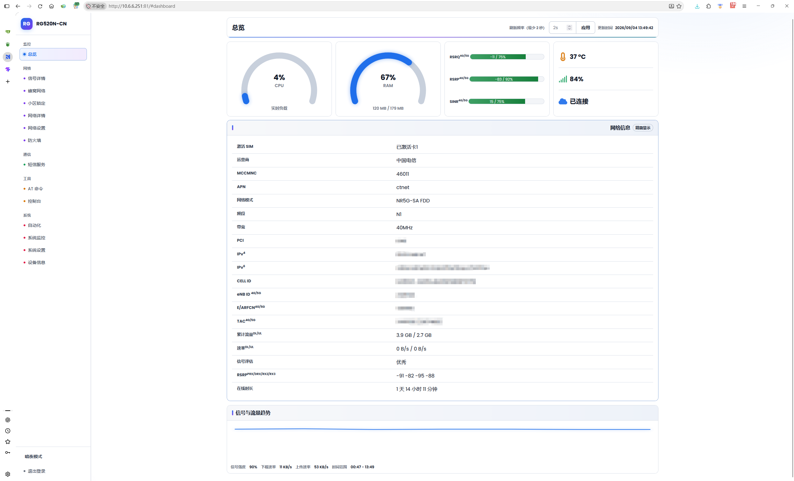
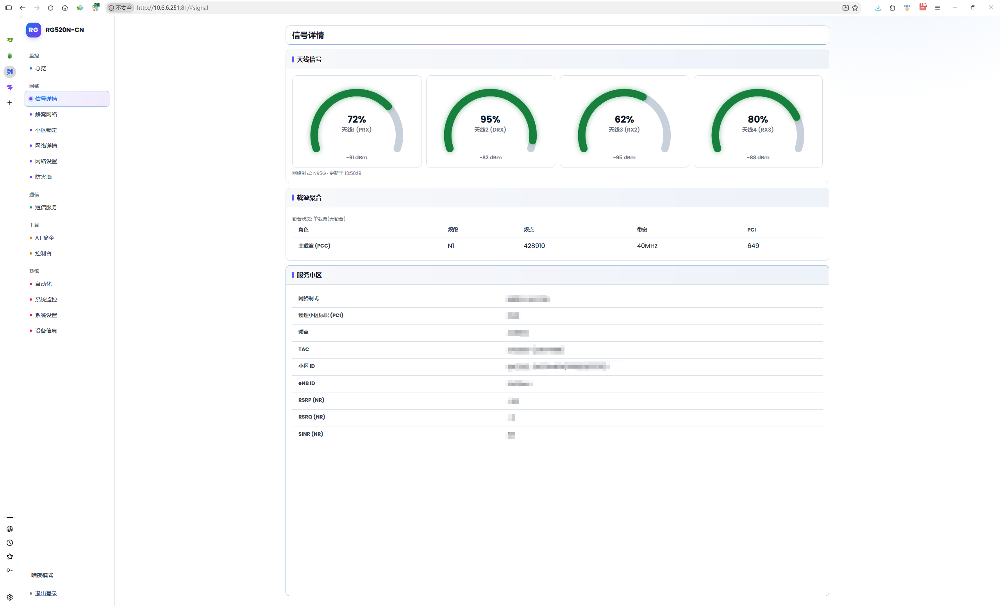
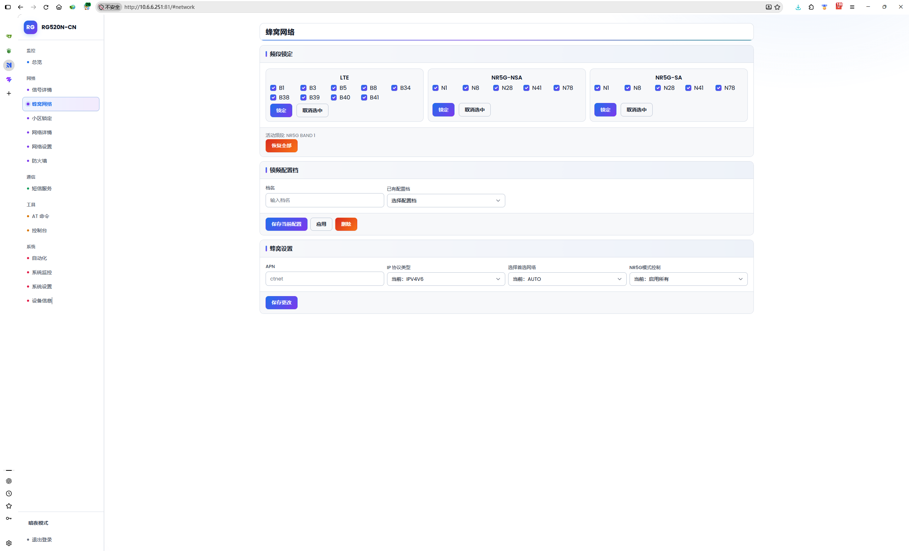
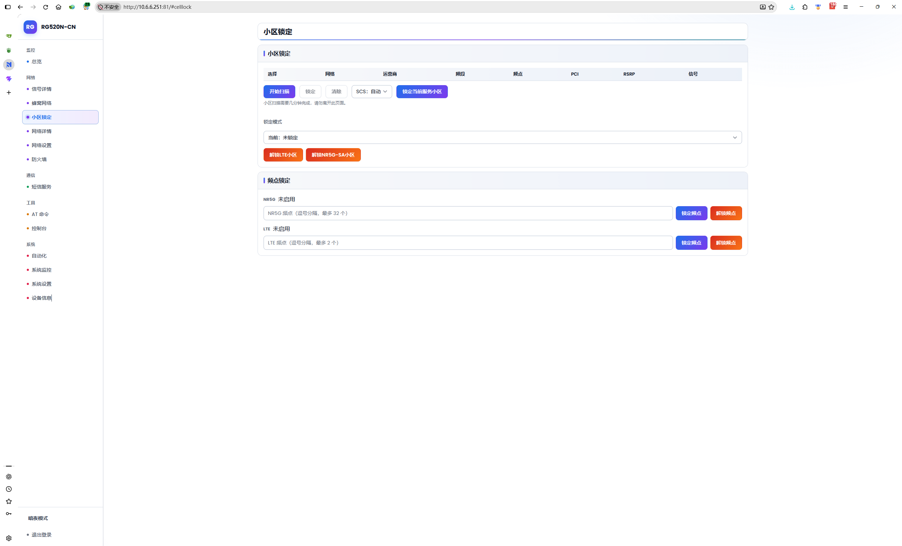
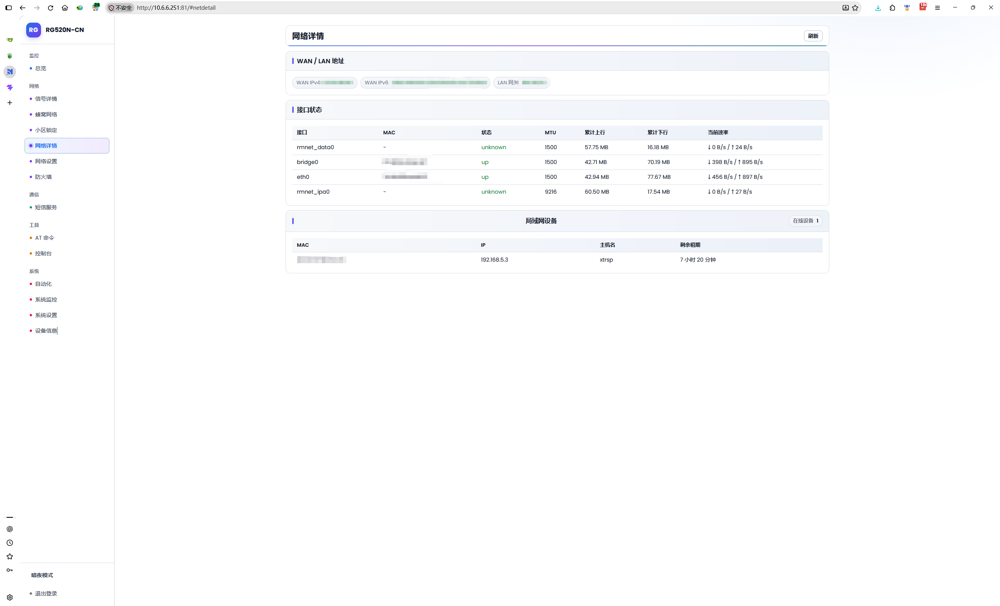
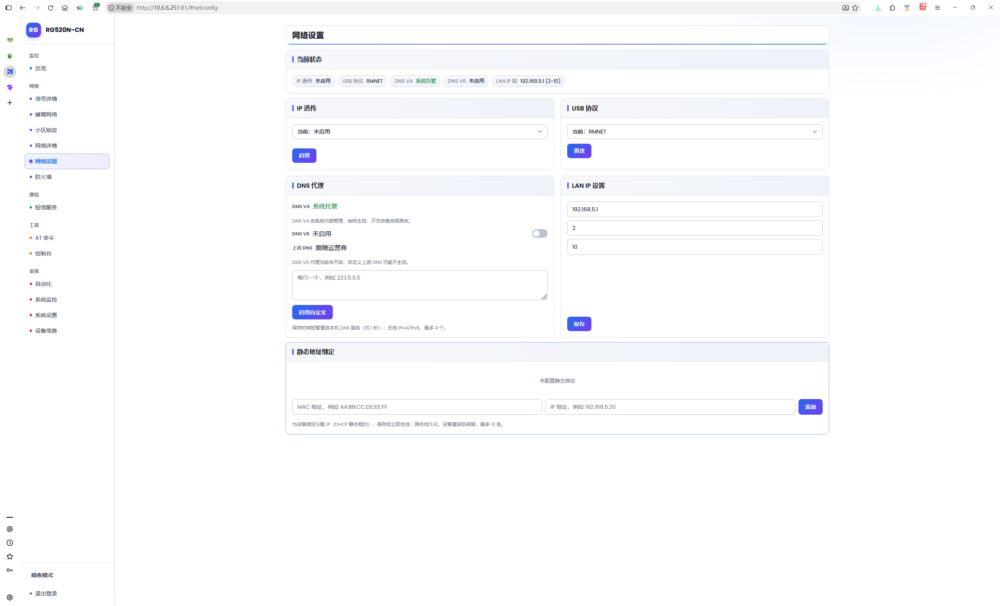
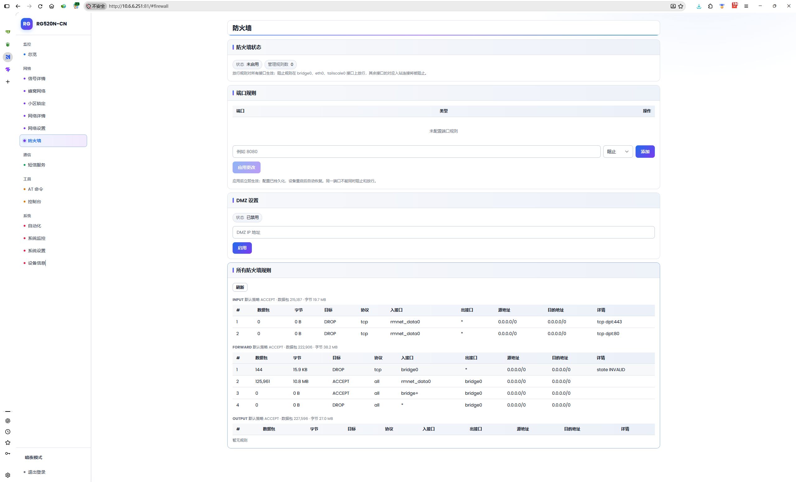
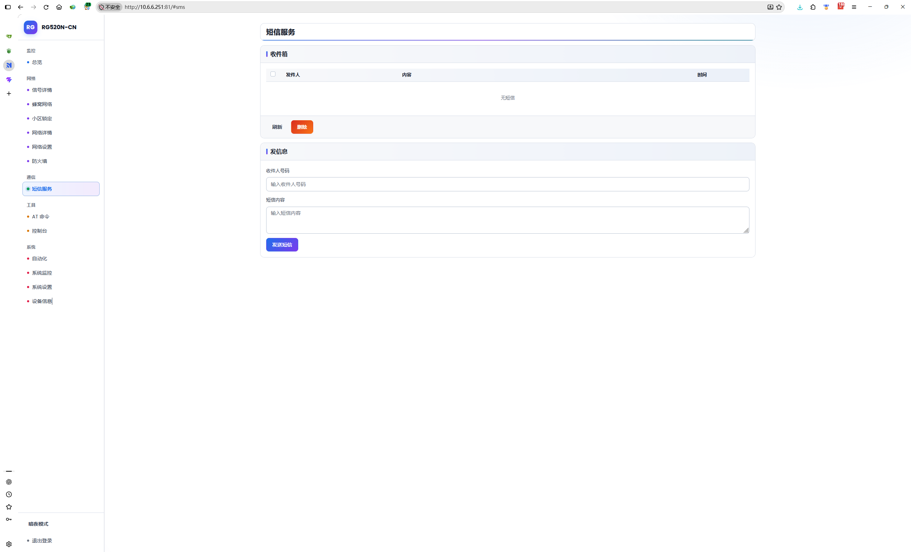

# SimpleAdmin Go

**SimpleAdmin Go** 是一个面向移远(Quectel)5G CPE 模块的本地化 Web 管理系统,由 **Go 单体后端** + **Vue 3 前端** 组成:后端负责静态页面托管、登录认证、AT 通道、短信、TTL、防火墙、控制台和状态接口;前端提供总览、信号、蜂窝网络、网络设置、防火墙、短信、AT 命令、控制台、系统监控等页面。整个系统离线打包,通过 Windows 批处理经 ADB **一键安装**到模块,无需模块联网、无需外部依赖。

[](LICENSE)


> **重要提醒(务必阅读)**
>
> 1. 安装此版本前**请务必卸载之前任何版本的 WebUI**,否则无法正常运行。
> 2. 安装成功后如果打不开后台,请**清理浏览器缓存**,并注意访问地址是 **http 不带 s**。
> 3. 如无法卸载旧版,可发送恢复出厂指令 `AT+QCFG="ResetFactory"` 后重刷固件;恢复出厂后需要重新开启网口和 ADB。

## 功能特性

| 分类 | 功能 |
|---|---|
| 总览仪表盘 | CPU / 内存 / 温度、实时负载、运营商与网络信息(频段、带宽、小区、TAC、ARFCN 等)、流量统计、信号评估、信号与流量趋势图(实时推送) |
| 信号详情 | 多路天线信号强度(PRX / DRX / RX2 / RX3)、服务小区参数、载波聚合状态 |
| 蜂窝网络 | LTE / NR5G(NSA / SA)频段锁定、锁频配置档、APN 设置、IP 类型、NR5G 模式控制 |
| 小区锁定 | 按物理小区标识(PCI)锁小区、锁频点,一键锁定当前服务小区 |
| 网络详情 | WAN / LAN 地址、各接口状态(MTU、累计流量、实时速率)、局域网在线设备与租期 |
| 网络设置 | IP 透传、DNS 代理(IPv4 / IPv6、自定义上游 DNS)、USB 网卡模式(RMNET 等)、LAN IP 网段、DHCP 静态绑定(MAC–IP) |
| 防火墙 | 端口放行 / 阻止规则、DMZ、完整 iptables 规则命中统计,配置持久化、重启自动恢复 |
| 短信服务 | 收件箱、发送短信(PDU 编码)、短信 Webhook 通知 |
| AT 命令 | Web 端直接发送 AT 命令并查看原始返回 |
| 控制台 | Web Shell,复用后台登录会话,进入即开终端 |
| 自动化 | 定时任务调度 |
| 系统监控 | TTL 设置与系统指标监控 |
| 系统设置 | 账号密码、界面语言、亮 / 暗主题 |
| 设备信息 | 模块型号、固件版本、IMEI 等设备信息,支持重启操作 |

其他亮点:

- **单二进制部署**:Go 静态编译(无外部依赖),前端纯静态文件由后端托管。
- **AT 通道独占与代理**:后端独占 `/dev/smd11` AT 通道,并经 Unix Socket 对外提供受限 AT 执行能力(见 [AT_PROXY.md](AT_PROXY.md)),外部程序无需停服即可安全执行 AT。
- **开机自愈**:DNS 上游、DHCP 静态租约等配置开机自动校对恢复;AT 开机保护期避免与模块初始化抢占。
- **M28 兼容**:无系统权限的模块也可以刷入后自动启动。

## 界面截图

| 总览 | 信号详情 |
|---|---|
|  |  |

| 蜂窝网络 | 小区锁定 |
|---|---|
|  |  |

| 网络详情 | 网络设置 |
|---|---|
|  |  |

| 防火墙 | 短信服务 |
|---|---|
|  |  |

## 支持设备

- **Quectel RG520N-CN** 5G CPE(高通 SDX65 平台,Linux armv7)——主要适配目标
- M28 等无系统权限的模块(刷入后可自动启动)

## 快速开始

### 1. 开启 ETH 网口

```text
开启:AT+QCFG="data_interface",0,0;+QCFG="pcie/mode",1;+QETH="eth_driver","r8125",1;+QCFG="usbnet",1;+QMAPWAC=1
关闭:AT+QCFG="data_interface",0,0;+QCFG="pcie/mode",0;+QETH="eth_driver","r8125",0;+QCFG="usbnet",0;+QMAPWAC=0
```

### 2. 开启 ADB

1. 查询 ADBKEY:`AT+QADBKEY?`
2. 计算 ADB 密码:<https://onecompiler.com/python/3znepjcsq>
3. 查询当前配置:`AT+QCFG="usbcfg"`,返回形如 `+QCFG: "usbcfg",0xXXXX,0xXXXX,1,1,1,1,1,0,0`,把**倒数第二位**的 `0` 改成 `1`
4. 下发配置:`AT+QCFG="usbcfg",0xXXXX,0xXXXX,1,1,1,1,1,1,0`(`0xXXXX,0xXXXX` 换成第 3 步查询到的值)
5. 重启模块:`AT+CFUN=1,1`

### 3. 一键安装

正常开启 ADB 后,Windows 下直接运行仓库根目录的 `toolkit.bat` 即可,完全离线安装:

```bat
toolkit.bat
```

脚本会自动等待 ADB 设备、推送安装包到模块并执行安装:优先以 systemd 服务启动;若 `/lib/systemd/system` 不可写或服务无法 active,自动降级为 `/usrdata` 后台启动 + 开机自启。安装脚本会先停止旧实例、释放 80 端口(含原厂 lighttpd),端口仍被占用时会在窗口给出中文提示。

### 4. 访问后台

- 默认地址:`http://192.168.225.1`(注意是 **http**,不带 s)
- 默认账号 / 密码:`admin` / `admin`
- 控制台页面复用后台登录会话,进入即开 shell,无独立终端口令

## 卸载

```bat
uninstall.bat
```

通过 ADB 调用模块端卸载脚本,并清理 dnsmasq 注入、TTL 规则等本服务写入的内容。若无法正常卸载,可发送 `AT+QCFG="ResetFactory"` 恢复出厂后重刷固件(之后需重新开启网口和 ADB)。

## 目录结构

```text
quectel-rgmii-toolkit-Go/
├── toolkit.bat                 # Windows 一键安装入口
├── uninstall.bat               # Windows 一键卸载入口
├── run_windows_test.bat        # Windows 本地预览测试入口(--mock 模式)
├── Makefile                    # 构建入口(make arm / windows / test ...)
├── .github/workflows/ci.yml    # CI:格式检查、静态分析、单测、样式一致性
├── adb.exe / AdbWin*.dll       # Windows ADB 工具
├── development/                # 模块端安装包(安装/卸载脚本、ARMv7 二进制、前端产物)
├── go-build/simpleadmin-go/    # Go 后端源码(单 package main)
├── windows-test/               # Windows 预览构建与前端冒烟测试
└── PNG/                        # 界面截图
```

完整的模块/函数级说明见 [ARCHITECTURE.md](ARCHITECTURE.md)。

## 构建与开发

依赖:Go(版本取自 `go-build/simpleadmin-go/go.mod`)、Node.js 20(仅前端冒烟测试需要)。

```sh
make arm          # 交叉编译 ARMv7 设备端二进制
make windows      # 编译 Windows 预览版
make test         # Go 全量单元测试(含 e2e mock)
make vet          # go vet 静态分析
make fmt-check    # gofmt 格式检查
make smoke        # 前端模块装配冒烟测试
make css          # 构建 Tailwind 样式
make css-check    # 样式产物一致性检查
make clean        # 清理产物
```

Windows 本地预览(无需设备):运行 `run_windows_test.bat`,以 `--mock` 模式启动测试服务,可在命令行窗口手动粘贴真实 AT 返回验证解析。

开发迭代指南(架构约定、构建、测试、部署、固件坑清单)见 [DEVELOPMENT.md](DEVELOPMENT.md);部署细则与验收清单见 [DEPLOY.md](DEPLOY.md)。修改代码前请先阅读 [AGENTS.md](AGENTS.md) 中的贡献守则。

## 常见问题

**Q:安装后打不开后台?**
先清理浏览器缓存,并确认地址是 `http://` 开头(不带 s);确认设备与电脑在同一网段或 USB 网络正常。

**Q:提示 80 端口被占用?**
安装脚本会自动停止旧 `simpleadmin-httpd` 与原厂 lighttpd 释放 80 端口;仍被占用时窗口会输出占用进程信息,按提示处理后重装。

**Q:想彻底恢复模块原状?**
运行 `uninstall.bat`;无法卸载时发送 `AT+QCFG="ResetFactory"` 恢复出厂后重刷固件,注意恢复出厂后需重新开启网口和 ADB。

**Q:外部程序如何执行 AT 命令?**
不要直接读写 `/dev/smd11`(会与主进程抢占)。使用 `simpleadmin-httpd at-client` 经 Unix Socket 代理执行,详见 [AT_PROXY.md](AT_PROXY.md)。

## 文档索引

| 文档 | 内容 |
|---|---|
| [ARCHITECTURE.md](ARCHITECTURE.md) | 目录结构、各文件与函数说明、主要运行流程、运行调试命令 |
| [DEVELOPMENT.md](DEVELOPMENT.md) | 开发与迭代指南:架构约定、AT 执行链、构建测试、固件坑清单 |
| [DEPLOY.md](DEPLOY.md) | 部署方式、验收清单、回滚 |
| [AT_PROXY.md](AT_PROXY.md) | AT 代理协议(供外部程序解析) |
| [AGENTS.md](AGENTS.md) | 后续代码修改方法(贡献守则) |

## 许可证

[MIT](LICENSE) © snjzb
